# EDA

남성의류, 여성의류, 패션잡화, 화장품/뷰티케어에 해당하는 데이터들을 대상으로 함.

## 데이터의 분포를 살펴보자

## Q. 명품을 가장 많이 소비하는 사람들은?

### 나이

- 전체 상품과 마찬가지로 명품의 30대 비중이 가장 크다.

- 하지만, 20대는 비율은 증가하고 40대 비율은 감소했다.

#### 명품

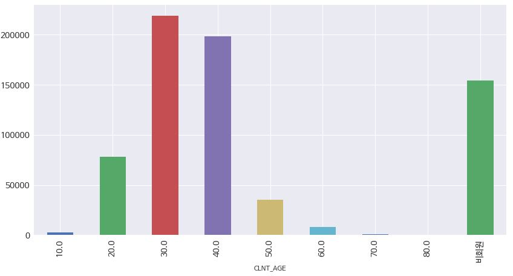

#### 전체

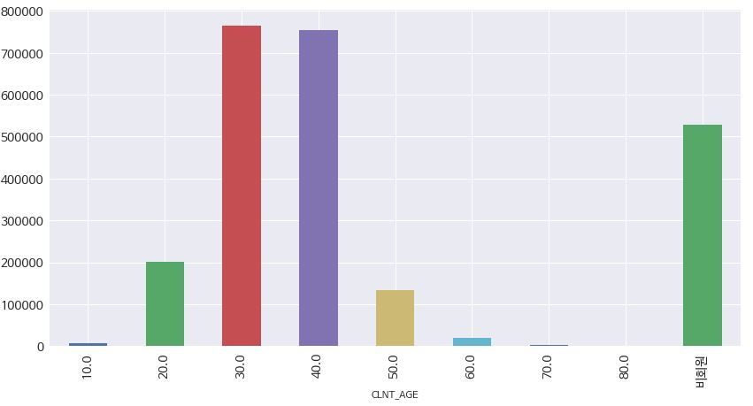

### 연령대 + 성별

- 남성은 큰 차이를 보이지 않았고 여성의 구매에서 큰 차이를 보인다.

- 20대, 40대에서 차이를 보인것은 여성 20대, 40대의 변화 때문으로 보인다.

#### 명품

#### 전체

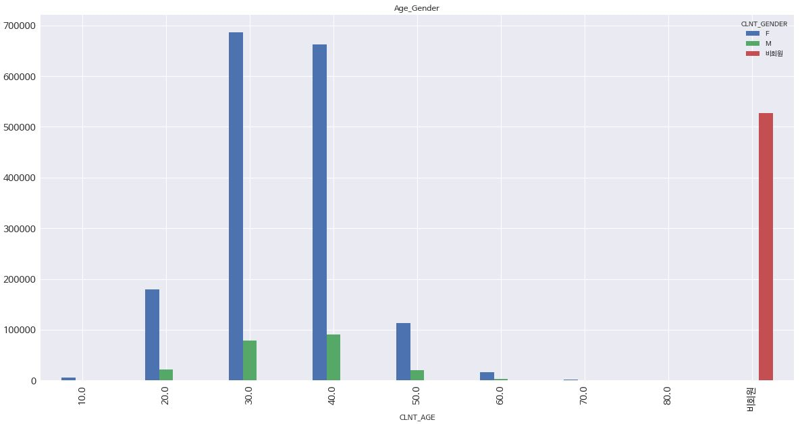

## Q. 명품을 가장 많이 소비하는 지역은?

### 지역

- 서울, 경기, 부산 순으로 구매가 많았다. 

- 전체상품과 명품의 분포는 큰 차이가 없다.

#### 명품

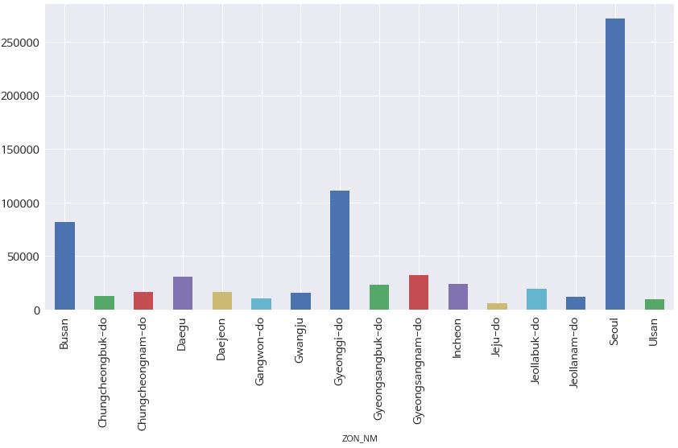

#### 전체

## Q.사람들은 어떤 카테고리의 명품을 가장 선호할까? 

### 대분류

- 화장품/뷰티케어의 비중이 크게 증가했다.

#### 명품

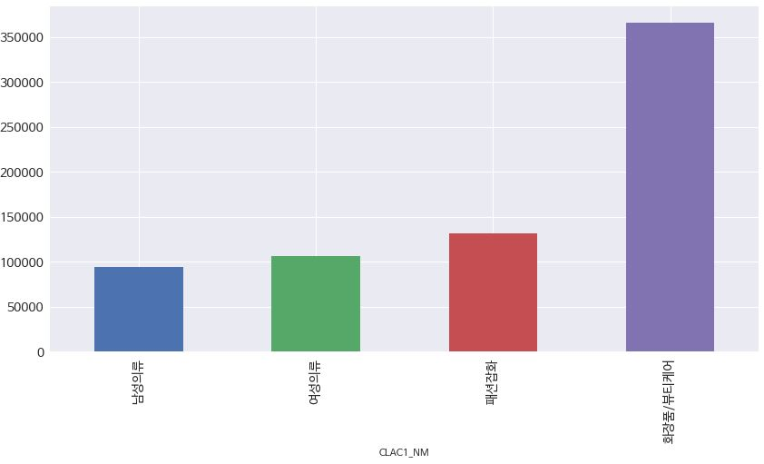

#### 전체

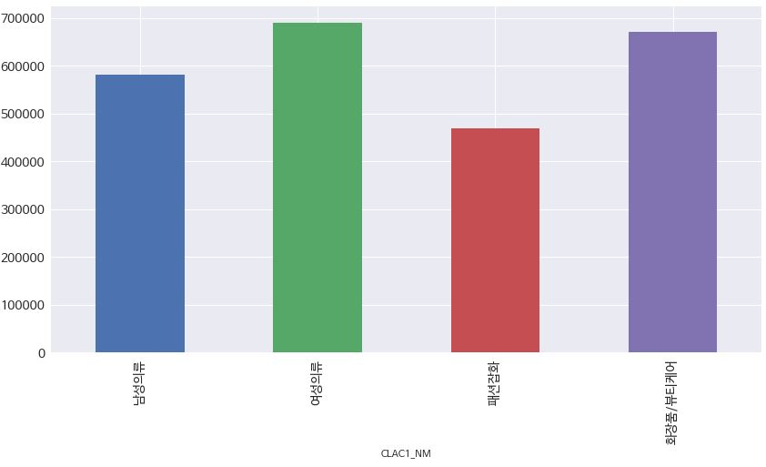

#### 성별 + 연령대

### 남성의류

- 상의의 비중이 증가하고, 하의의 비중이 줄어들었다.

#### 명품

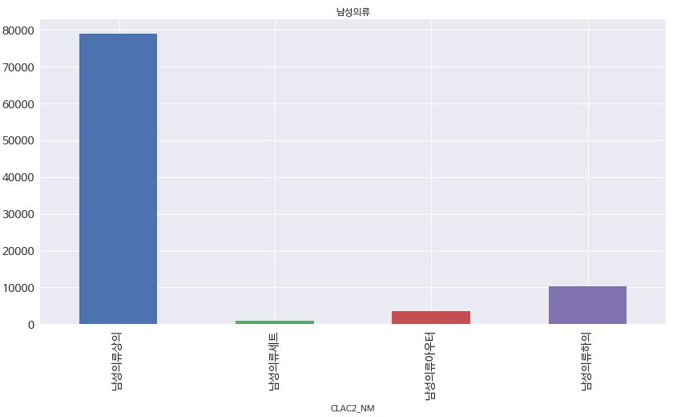

#### 전체

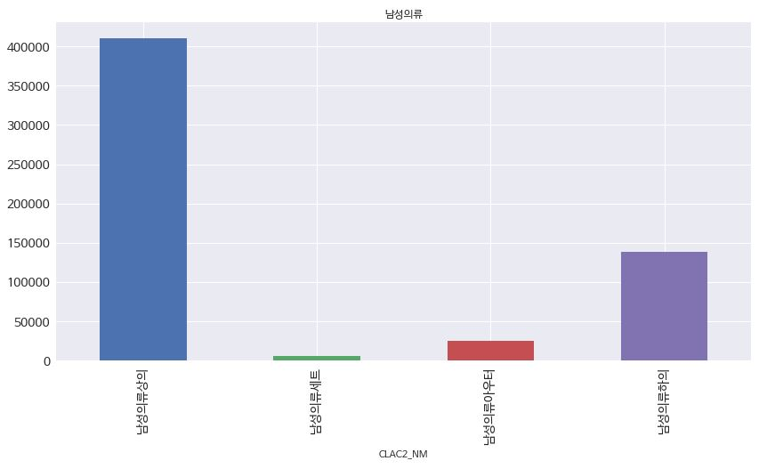

#### 성별+연령대

### 여성의류

- 아우터의 비율이 증가하고 전신, 하의의 비율은 감소했다. 

#### 명품

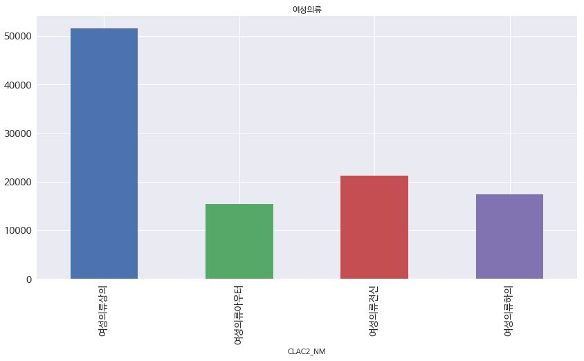

#### 전체

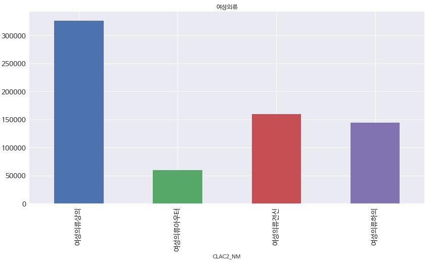

#### 성별+연령대

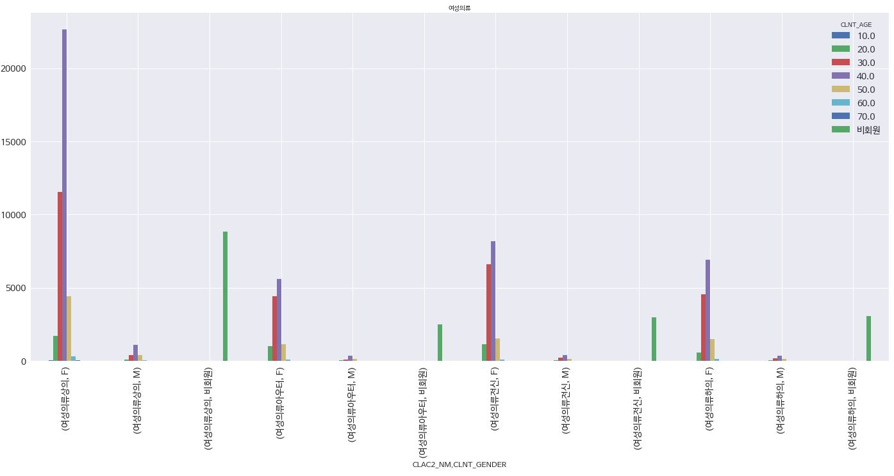

### 패션잡화

- 여성화, 유아동화의 비율이 크게 감소하고, 여성가방,보석, 패션악세서리의 비율이 크게 증가했다.

#### 명품

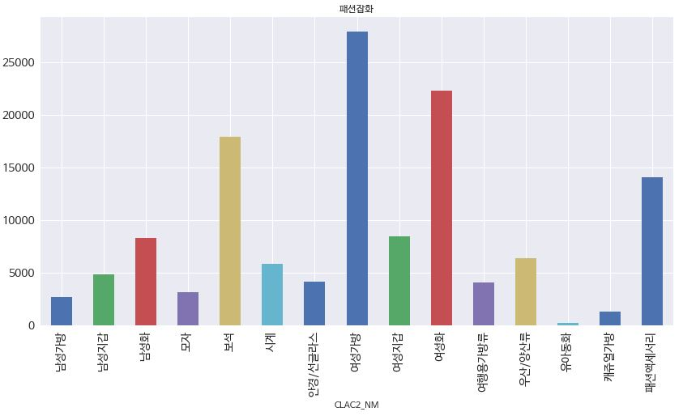

#### 전체

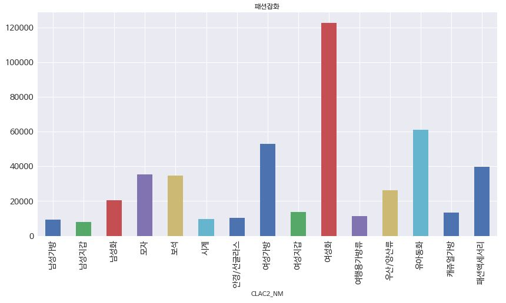

#### 성별+연령대

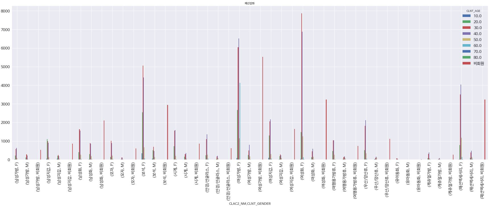

### 화장품/뷰티케어

- 메이크업의 비율이 증가하고, 나머지의 비율이 전반적으로 감소했다.

#### 명품

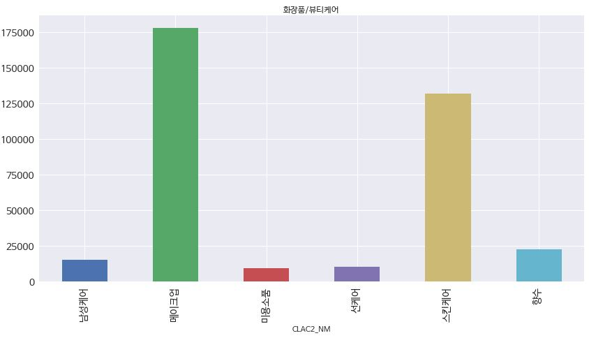

#### 전체

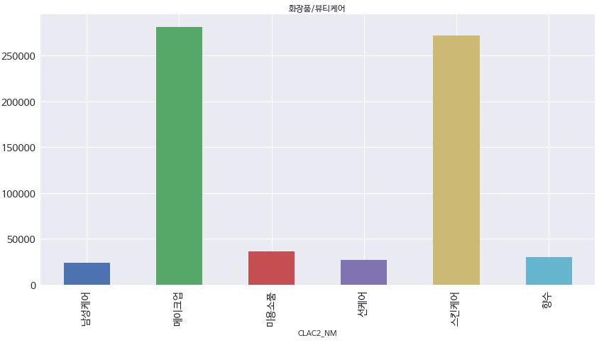

#### 성별+연령대

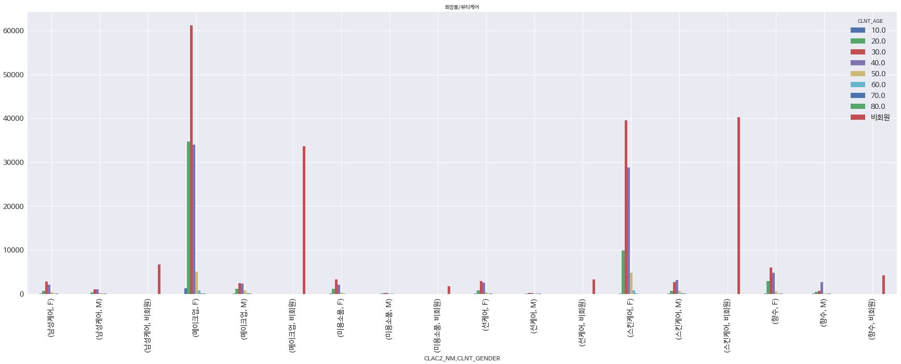

## Q. 가장 많이 검색한 키워드는?